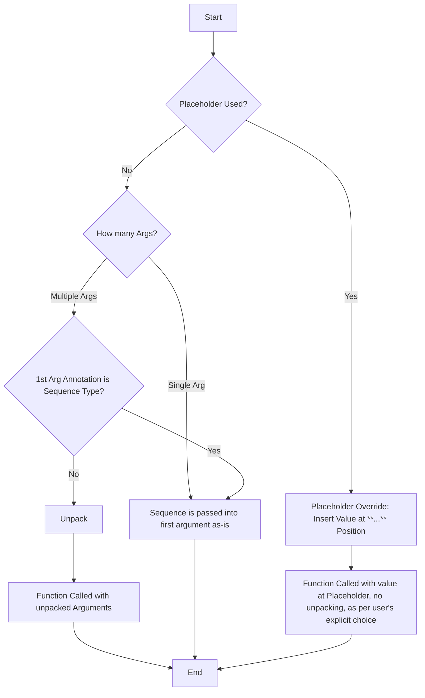

# Pypeduct Pipeline Argument Unpacking Specification

## 1. Introduction

This document details the argument unpacking behavior within pypeduct pipelines, focusing on how sequences (tuples, lists) are handled when passed to functions using the pipe operator (`>>`).

## 2. Core Principles: Explicit > Implicit; Practicality > Purity.

Pypeduct's argument unpacking is governed by the following principles:

**Default to Unpacking, Control via First Argument Type Annotation - *Unless Overridden by Placeholder*.**

*   **Default Behavior: Unpack.**  When a sequence (tuple, list, etc.) is piped into a function, pypeduct will generally attempt to *unpack* the sequence elements as positional arguments into the function, if the number of arguments allow it; If the function only has a single argument, the sequence is passed as is.
*   **Annotation Control: Prevent Unpacking with Sequence Type Hint.** If the first positional argument is explicitly annotated as a *sequence type*, pypeduct will *not unpack* the sequence and pass it as a single argument to the function, respecting the type hint and ignoring potentially empty left-over arguments (which will need to be addressed in some other way).
*   **Placeholder Override: Explicit `...` Disables Unpacking.** The argument position indicator or "placeholder" (`...`) provides the most direct control and **completely disables** the automatic argument unpacking behavior based on type annotations. Only a single placeholder is allowed per function call and it can be used for positional or keyword arguments.

## 3. Unpacking Decision Logic

The decision to unpack or not unpack a sequence passed via a pipeline is determined by the number of arguments, then the type annotation of the **first positional argument** of the function on the right side of the pipe (`>>`) **unless the argument position placeholder (`...`) is used.**


### 3.1. Rule: Check First Argument's Type Annotation (When Placeholder Not Used)

This rule only applies if the argument position placeholder (...) is not used in the function call.

Examine the Type Annotation:  Get the type annotation of the first positional argument of the function receiving the piped value.

Is it a General Sequence Type?  Determine if the annotation is one of the following "general sequence types":

* Sequence (from typing or collections.abc)
* List (from typing)
* Tuple (from typing)
* Iterable (from typing or collections.abc)
* list (built-in)
* tuple (built-in)


### 3.2. Example Scenarios (Type Annotation Controlled Unpacking)


```python
# No type annotations on function and lambda arguments
(1, 2) >> (lambda x, y: x + y)  # Transforms to: (lambda x, y: x + y)(1, 2)

def add(a, b):
    return a + b

(3, 4) >> add  # Transforms to: add(3, 4)

# Function defined with def (non-sequence annotations)
def multiply_strings(text: str, count: int):
    return text * count

("hello", 3) >> multiply_strings  # Transforms to: multiply_strings(*("hello", 3))


# Function annotated as list
def process_sequence(items: list[int]):
    return len(items)

[10, 20, 30] >> process_sequence  # Transforms to: process_sequence([10, 20, 30]) # No unpack

# Function annotated as list
def process_list(item_list: list[int]):
    return sum(item_list)

(5, 6, 7) >> process_list  # Transforms to: process_list((5, 6, 7)) # No unpack

# Function annotated as list of tuples
def handle_coordinates(points: list[tuple[int, int]], factor=1):
    return [sum(p*factor) for p in points]

# No unpacking, even with two potential positional arguments (points, factor)
[(1, 2), (3, 4)] >> handle_coordinates # Transforms to: handle_coordinates([(1, 2), (3, 4)])

# let's have a different factor, but still no unpacking
[(1, 2), (3, 4)] >> handle_coordinates(factor=2) # Transforms to: handle_coordinates([(1, 2), (3, 4)], factor=2)

```

## 4. Argument Position Indicator - `...` Placeholder - Overrides Unpacking

Pypeduct provides a Placeholder, represented by the ellipsis symbol `...`, to explicitly control where the value from the left side of the pipe (>>) is inserted within the arguments of the function on the right side. Crucially, the use of `...` disables all automatic tuple unpacking based on type annotations.

### 4.1. Purpose of the Indicator

The `...` placeholder allows you to:

* Specify the exact argument position: Instead of relying on default unpacking or type-hint based behavior, you can use `...` to force the piped value to be placed at a specific positional or keyword argument location.
* Explicit Control: Provides the most direct and unambiguous way to control argument placement, overriding any implicit unpacking rules.
* Flexibility: Useful when piping data into functions expecting input at non-first positions or when combining piped values with other arguments in a specific order, regardless of type hints.

### 4.2. Usage and Behavior

* Placement: The `...` placeholder can be used in:
  * Positional arguments: Within the list of positional arguments in a function call.
  * Keyword argument values: As the value assigned to a keyword argument.
* Single Placeholder per Call:  Only one `...` placeholder is allowed within function call in a pipeline expression. Using more than one placeholder will result in a PipeTransformError.
* Left Side Restriction: The `...` placeholder is not allowed on the left side of the pipe (>>). It must always be used on the right side, within a function call.
* Insertion of Piped Value:  During transformation, the `...` placeholder is replaced by the expression from the left side of the pipe, without any unpacking applied.

### 4.3. Examples of Placeholder Usage (Unpacking Override)

#### 4.3.1. Placeholder in Positional Argument - Disables Unpacking

```python

def process_data(a_list: list, b_list:list): # List type hint would normally prevent unpacking
    return a_list - b_list


(4, 5, 6) >> process_data([1,2,3] ,...) # Transforms to: process_data([1, 2, 3], [4, 5, 6]) # No unpacking, '...' overrides type hint and can be used in any position.

# Compare to no placeholder but with type hint
[4, 5, 6] >> process_data([1,2,3]) #  -> process_data([4,5,6], [1, 2, 3]) # No unpacking, hint is respected, but order is different.
```

#### 4.3.2. Placeholder in Keyword Argument - Disables Unpacking

```python
def add_parts(start="hello", middle="world", end="!"):
    return start + middle + end

# Using placeholder in keyword argument
"there" >> add_parts(middle=...) # Transforms to: add_parts(middle="there"), no unpacking

# or
("cruel", "world") >> add_parts(middle=...) # Transforms to: add_parts(start="hello", middle=("cruel", "world"), end="!"), no unpacking

# maybe the user wants to fix this, so they could do this:
("cruel", "world") >> ' '.join >> add_parts(middle=...) # Transforms to: add_parts(start="hello", middle="cruelworld", end="!"), no unpacking

```

### 4.4. Error Cases (Placeholder Related)

#### 4.4.1. Placeholder on the Left Side (Error)

```python
# Invalid -  "..." on the left side is not allowed
# ... >> (lambda x: x + 1) # This will raise a PipeTransformError
```

#### 4.4.2. Multiple Placeholders (Error)

```python
def combine(a, b, c):
    return a + b + c

# Invalid - Only one "..." placeholder is allowed per function call
# (1, 2, 3) >> (lambda x, y, z: combine(..., ..., ...)) # This will raise a PipeTransformError
```

## 6. Conclusion

This specification comprehensively defines sequence unpacking and argument insertion in pypeduct pipelines.  The argument position placeholder (...) provides explicit control and disables the default annotation-based unpacking, offering users maximum flexibility in constructing their data processing pipelines.