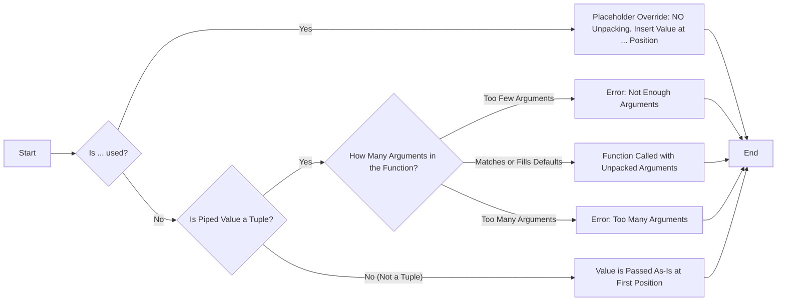

# Pypeduct Pipeline Tuple Unpacking Specification

## 1. Introduction

This document details the tuple unpacking behavior within pypeduct pipelines, focusing on how tuples are handled when passed to functions using the pipe operator (`>>`).

## 2. Core Principles: Explicit > Implicit; Practicality > Purity

Pypeduct's tuple unpacking is governed by the following principles:

**Default to Unpacking Tuples, Placeholder for Override.**

* **Default Behavior: Unpack.** Always Unpack Tuples. When a tuple is piped into a function, pypeduct will always attempt to unpack the tuple elements as positional arguments to the function, **filling in default arguments automatically when available**.
* **Lists and other Iterables are Passed As-Is**: When a list is piped into a function, it will always be passed as a single argument.
* **Placeholder Override: Explicit `...` Disables Unpacking.** The argument position indicator or "placeholder" (`...`) provides the most direct control and **completely disables** the automatic tuple unpacking. Only a single placeholder is allowed per function call and it can be used for positional or keyword arguments.

## 3. Unpacking Decision Logic

The decision to unpack or not unpack a sequence passed via a pipeline is determined by the number of arguments, then the type annotation of the **first positional argument** of the function on the right side of the pipe (`>>`) **unless the argument position placeholder (`...`) is used.**



### 3.1 Handling Default Arguments
Shallow Unpacking Only: Tuple unpacking will only unpack the top-level elements of the tuple. Nested structures, such as (1, (2, 3)), will be passed as-is for the nested elements.

Default Arguments: Default arguments in the function are automatically used to fill in any missing parameters from the tuple as far as possible. For example:

```python
def greet(name, message="Hello"):
    return f"{message}, {name}!"

("Alice",) >> greet  # -> greet("Alice", "Hello")
("Alice", "Hi") >> greet  # -> greet("Alice", "Hi")

#Error for Too Few Arguments: If the tuple provides fewer arguments than the function requires (without sufficient defaults), an error is raised during execution:

def greet(name, message, punctuation="!"):
    return f"{message}, {name}{punctuation}"

("Alice",) >> greet  # Raises: TypeError: Expected at least 2 arguments, got 1
# Error for Too Many Arguments: If the tuple provides more arguments than the function can handle (without variadic parameters), an error is also raised:

def greet(name, message):
    return f"{message}, {name}"

("Alice", "Hi", "!") >> greet  # Raises: TypeError: Too many arguments provided
```

* **Default arguments are automatically filled.** If a function has default arguments, a tuple will be unpacked as far as possible, filling in defaults when needed.

```python
def greet(name, message="Hello"):
    return f"{message}, {name}!"

("Alice",) >> greet  # Now works: greet("Alice", "Hello")
("Alice", "Hi") >> greet  # Works: greet("Alice", "Hi")
```

* **If a function requires more arguments than provided in the tuple (without defaults), an error is raised.**

```python
def greet(name, message, punctuation="!"):
    return f"{message}, {name}{punctuation}"

("Alice",) >> greet  # TypeError: Expected at least 2 arguments, got 1
```

### 3.2 Handling *args (Variadic Functions)
* **If a function has `*args`, tuples are unpacked by default.**

```python
def collect_args(*args):
    return args

(1, 2) >> collect_args  # Returns (1, 2), since *args absorbs multiple values

(1, 2) >> collect_args(...)  # Returns ((1, 2),), since ... disables unpacking
```

### 3.3 Common Use Cases

```python
(1, 2) >> (lambda x, y: x + y)  # -> (lambda x, y: x + y)(1, 2)
(1, (2,3)) >> lambda x, y: x + y  # -> (lambda x, y: x + y)(1, (2, 3))

def add(a, b):
    return a + b

(3, 4) >> add  # -> add(3, 4)

# Function defined with def (non-sequence annotations)
def multiply_strings(text: str, count: int):
    return text * count

("hello", 3) >> multiply_strings  # -> multiply_strings("hello", 3)


# Function annotated as list
def process_sequence(items: list[int]):
    return len(items)

[10, 20, 30] >> process_sequence  # -> process_sequence([10, 20, 30])

# Function annotated as list of tuples
def handle_coordinates(points: list[tuple[int, int]], factor=1):
    return [sum(p*factor) for p in points]

# No unpacking, even with two potential positional arguments (points, factor)
[(1, 2), (3, 4)] >> handle_coordinates # -> handle_coordinates([(1, 2), (3, 4)])

# let's have a different factor, but still no unpacking
[(1, 2), (3, 4)] >> handle_coordinates(factor=2) # -> handle_coordinates([(1, 2), (3, 4)], factor=2)

# Error! Unpacking is attempted, but mismatching arguments - by design! To avoid this issue, use the placeholder `...`.

((1, 2), (3, 4)) >> handle_coordinates # -> handle_coordinates(items=(1, 2), factor=(3, 4)) which will raise a TypeError
```

### 3.4 Argument Position Indicator - `...` Placeholder - Overrides Unpacking

Pypeduct provides a Placeholder, represented by the ellipsis symbol `...`, to explicitly control where the value from the left side of the pipe (>>) is inserted within the arguments of the function on the right side. Crucially, the use of `...` disables all automatic tuple unpacking.

#### 3.4.1 Purpose of the Indicator

The `...` placeholder allows you to:

* Specify the exact argument position: Instead of relying on default unpacking or type-hint based behavior, you can use `...` to force the piped value to be placed at a specific positional or keyword argument location.
* Explicit Control: Provides the most direct and unambiguous way to control argument placement, overriding any implicit unpacking rules.
* Flexibility: Useful when piping data into functions expecting input at non-first positions or when combining piped values with other arguments in a specific order, regardless of type hints.

#### 3.4.2 Usage and Behavior

* Placement: The `...` placeholder can be used in:
  * Positional arguments: Within the list of positional arguments in a function call.
  * Keyword argument values: As the value assigned to a keyword argument.
* Single Placeholder per Call:  Only one `...` placeholder is allowed within function call in a pipeline expression. Using more than one placeholder will result in a PipeTransformError.
* Left Side Restriction: The `...` placeholder is not allowed on the left side of the pipe (>>). It must always be used on the right side, within a function call.
* Insertion of Piped Value:  During transformation, the `...` placeholder is replaced by the expression from the left side of the pipe, without any unpacking applied.

#### 3.5. Examples of Placeholder Usage (Unpacking Override)

#### 3.5.1. Placeholder in Positional Argument - Disables Unpacking

```python

def process_data(a_list: list, b_list:list):
    return a_list - b_list


(4, 5, 6) >> process_data([1,2,3] ,...) # -> process_data([1, 2, 3], [4, 5, 6]) # No unpacking, '...' overrides type hint and can be used in any position.

[4, 5, 6] >> process_data([1,2,3]) #  -> process_data([4,5,6], [1, 2, 3]) # No unpacking because value is not a tuple but order is different.
```

#### 5.3.2. Placeholder in Keyword Argument - Disables Unpacking

```python
def add_parts(start="hello", middle="world", end="!"):
    return start + middle + end

# Using placeholder in keyword argument
"there" >> add_parts(middle=...) # -> add_parts(middle="there"), no unpacking

# or
("cruel", "world") >> add_parts(middle=...) # -> add_parts(start="hello", middle=("cruel", "world"), end="!"), no unpacking

# maybe the user wants to fix this, so they could do this:
("cruel", "world") >> ' '.join >> add_parts(middle=...) # -> add_parts(start="hello", middle="cruel world", end="!")

```

#### 3.4. Error Cases (Placeholder Related)

##### 3.4.1. Placeholder on the Left Side (Error)

```python
# Invalid -  "..." on the left side is not allowed
# ... >> (lambda x: x + 1) # This will raise a PipeTransformError
```

##### 3.4.2. Multiple Placeholders (Error)

```python
def combine(a, b, c):
    return a + b + c

# Invalid - Only one "..." placeholder is allowed per function call
# (1, 2, 3) >> combine(..., ..., ...) # This will raise a PipeTransformError
```

## 4. Conclusion

This specification comprehensively defines sequence unpacking and argument insertion in pypeduct pipelines.  The argument position placeholder (...) provides explicit control and disables the unpacking, offering users maximum flexibility in constructing their data processing pipelines.